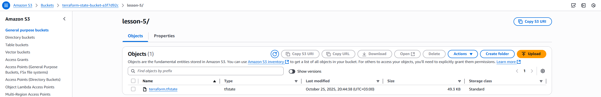
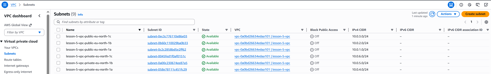
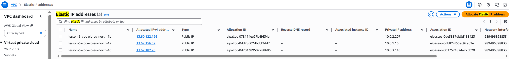
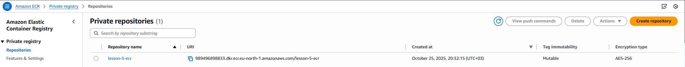

# 🧱 Lesson 5 – Infrastructure as Code with Terraform (AWS)

This project demonstrates practical usage of **Terraform** for provisioning AWS infrastructure as code (IaC).  
The goal is to build a reusable, modular, and secure Terraform setup with remote state storage, networking, and container registry resources.

---

## 🎯 Objectives

1. Configure a **remote backend** for Terraform using **S3** (for state) and **DynamoDB** (for state locking).
2. Deploy core AWS infrastructure components using Terraform:
   - Virtual Private Cloud (**VPC**) with public and private subnets
   - **Internet Gateway** and **NAT Gateways** for connectivity
   - **Elastic Container Registry (ECR)** for storing Docker images
3. Document the setup process for reproducibility and team collaboration.

---

## 🗂️ Project Structure

lesson-5/
│
├── main.tf
├── backend.tf
├── outputs.tf
│
├── modules/
│ │
│ ├── s3-backend/
│ │ ├── s3.tf
│ │ ├── dynamodb.tf
│ │ ├── variables.tf
│ │ └── outputs.tf
│ │
│ ├── vpc/
│ │ ├── vpc.tf
│ │ ├── routes.tf
│ │ ├── variables.tf
│ │ └── outputs.tf
│ │
│ └── ecr/
│ ├── ecr.tf
│ ├── variables.tf
│ └── outputs.tf
│
└── README.md

---

## ⚙️ Modules Overview

### 🪣 Module: `s3-backend`

Creates:

- **S3 bucket** for storing Terraform state files
- **DynamoDB table** for state locking
- Bucket versioning and encryption enabled

Outputs:

- S3 bucket name
- DynamoDB table name

---

### 🌐 Module: `vpc`

Creates:

- **VPC** with CIDR block
- 3 public and 3 private subnets across different Availability Zones
- **Internet Gateway (IGW)** for public subnets
- **NAT Gateways** for private subnets
- **Route tables** for traffic routing

Outputs:

- VPC ID
- Public and private subnet IDs

---

### 📦 Module: `ecr`

Creates:

- **ECR repository** with image scanning on push
- Configures encryption and tagging

Outputs:

- Repository URL

---

## 🧩 Backend Configuration

Terraform backend stores the project’s state remotely in AWS S3 and uses DynamoDB for locking to prevent parallel modifications.

## 🔄 Terraform Workflow and Remote Backend

This project uses a **remote backend (S3 + DynamoDB)** to safely store and lock Terraform state files.
All Terraform commands operate on this centralized remote state to avoid configuration drift when working in teams.

The standard workflow is:

1. `terraform init` – connect to backend and download providers
2. `terraform plan -out=tfplan` – generate a plan of upcoming changes
3. `terraform apply tfplan` – apply the exact plan
4. `terraform destroy` – tear down the infrastructure

This guarantees repeatability and prevents concurrent state modifications.

## Prerequisites

- Terraform >= 1.9.0 (see https://www.terraform.io/downloads)

  - Verify: `terraform version`
  - Provider requirement: `hashicorp/aws` ~> 5.0 (declared in main.tf)

- AWS CLI v2 installed and configured with a profile (example profile name: `terraform`)
  - Install (Windows): `choco install awscli`
  - Configure: `aws configure --profile terraform`
  - Verify: `aws sts get-caller-identity --profile terraform`

## 🔐 AWS Access Configuration for Terraform

### 1. Create a dedicated IAM user `terraform`

For security reasons, Terraform should **not** run using the root account or an admin user.  
Instead, create a separate IAM user with only the permissions required for managing infrastructure.

#### Steps:

1. Open **AWS Management Console → IAM → Users → Create user**
2. Enter the username: terraform
3. Select **Access type → Programmatic access** (CLI/API only, no Console login).
4. Create a new **user group** named `terraform-lab` and attach the following managed policies:

- `AmazonS3FullAccess` – for storing Terraform state files in S3
- `AmazonDynamoDBFullAccess_v2` – for DynamoDB state locking
- `AmazonEC2FullAccess` – for creating VPC, subnets, NAT, and routing
- `AmazonEC2ContainerRegistryFullAccess` – for managing private ECR repositories

5. Add the user `terraform` to the group `terraform-lab`.
6. Generate **Access Keys** for this user:

- Navigate to `IAM → Users → terraform → Security credentials`
- Click **Create access key**
- Choose _Application running outside AWS_
- Save the `Access key ID` and `Secret access key` securely.

---

### 2. Configure AWS CLI Profile (Windows)

1. Install AWS CLI if not already installed:

```powershell
choco install awscli

```

2. Configure a new CLI profile named terraform:

```
aws configure --profile terraform
```

Enter the values:

```
AWS Access Key ID [None]: <your_access_key>
AWS Secret Access Key [None]: <your_secret_key>
Default region name [None]: eu-north-1
Default output format [None]: json
```

Verify the connection:

```
aws sts get-caller-identity --profile terraform
```

You should see your AWS Account ID and the ARN of the terraform user.

### 3. Using the profile in Terraform

In your Terraform configuration, specify the created profile:

```hcl
provider "aws" {
region = "eu-north-1"
profile = "terraform"
}
```

Terraform will automatically load credentials from this AWS CLI profile when executing commands.

This setup uses:

- **AWS region:** `eu-north-1`
- **AWS CLI profile:** `terraform`

Make sure that the same region and profile are configured in your AWS CLI before running any Terraform commands.

4. Validation and Initialization

Before deployment, run:

terraform init
terraform plan
terraform apply

Terraform will authenticate through your terraform IAM user using the terraform profile, ensuring secure and isolated access to AWS resources without requiring admin privileges.

---

---

## 🚀 How to Run

This project uses a **remote backend** (S3 + DynamoDB) for Terraform state management.  
If you're running this project from a fresh clone, you must first recreate the backend infrastructure locally before reconnecting to S3.

---

### 1️⃣ Comment out the backend

Before the first run, open `\lesson-5\backend.tf` and temporarily disable the backend block:

```hcl
# terraform {
#   backend "s3" {
#     bucket         = "terraform-state-bucket-a3f7d92c"
#     key            = "lesson-5/terraform.tfstate"
#     region         = "eu-north-1"
#     dynamodb_table = "terraform-locks"
#     encrypt        = true
#     profile        = "terraform"
#   }
# }
```

Terraform cannot initialize directly to an S3 backend if the bucket and DynamoDB table don’t exist yet.
This step ensures that state is handled locally until backend resources are provisioned.

### 2️⃣ Initialize and deploy infrastructure locally

Run the following commands:

```
terraform init
terraform validate
terraform plan -out=tfplan
terraform apply tfplan
```

✅ This will create all project resources, including:

- S3 bucket terraform-state-bucket-a3f7d92c for storing remote Terraform state
- DynamoDB table terraform-locks for state locking
- VPC, subnets, Internet Gateway, NAT gateways
- ECR repository for container images

⚠️ Note: At this stage, Terraform still uses a **local state file (terraform.tfstate)**.  
The backend (S3 + DynamoDB) will be connected in the next step.

### 3️⃣ Re-enable the backend and migrate state to S3

Once all resources are created, uncomment the backend configuration in backend.tf:

```
terraform {
  backend "s3" {
    bucket         = "terraform-state-bucket-a3f7d92c"
    key            = "lesson-5/terraform.tfstate"
    region         = "eu-north-1"
    dynamodb_table = "terraform-locks"
    encrypt        = true
    profile        = "terraform"
  }
}
```

Reconfigure Terraform to use the remote backend and migrate the local state to S3:

```
terraform init -reconfigure
```

When prompted:

```
Do you want to copy existing state to the new backend? (yes)
```

Type **yes** — Terraform will upload the local terraform.tfstate file to your S3 bucket and start using it as a remote state.

### 4️⃣ Validate backend connection

Run:

```
terraform state list
terraform plan
```

Expected output:

```
No changes. Infrastructure is up-to-date.
```

In AWS Console:

S3 → you should see the file lesson-5/terraform.tfstate in bucket terraform-state-bucket-a3f7d92c

DynamoDB → table terraform-locks will briefly show a LockID during Terraform operations

### 5️⃣ Destroy all resources

🧹 Proper teardown when using an S3 backend (with DynamoDB locking)

Terraform cannot safely destroy its own remote backend if that backend is stored in an S3 bucket with versioning enabled. A simple `terraform destroy` may fail with:

- Error: `BucketNotEmpty` — the S3 bucket still contains objects or versions.
- Error releasing the state lock — DynamoDB lock table missing or unreadable.

Follow these steps to safely destroy all infrastructure, including backend resources.

🔧 **_Step-by-step teardown procedure_**

1. Comment out the S3 backend block in `/lesson-5/backend.tf` so Terraform will use a local backend for the teardown.

```hcl
# terraform {
#   backend "s3" {
#     bucket         = "terraform-state-bucket-XXXX"
#     key            = "lesson-5/terraform.tfstate"
#     region         = "eu-north-1"
#     dynamodb_table = "terraform-locks"
#     encrypt        = true
#     profile        = "terraform"
#   }
# }
```

2. Re-initialize Terraform to use a local backend:

```
terraform init -reconfigure
# If prompted to migrate the state, confirm with:
# terraform init -migrate-state -lock=false
```

Terraform will now keep the state file locally (terraform.tfstate).

3. Refresh the local state without changing resources:

```
terraform plan -refresh-only
terraform apply -refresh-only -auto-approve
```

This ensures that the local state reflects the actual resources currently existing in AWS.

4. Manually empty the S3 bucket (including all versions and delete markers). Using the AWS Console is simplest for versioned buckets:

- Open S3 → your bucket → Show versions → select all objects & versions → Delete → Permanently delete.

5. Run final destroy:

```bash
terraform destroy -auto-approve
```

Now Terraform will cleanly remove:
All VPC, subnets, NAT gateways, etc.
The DynamoDB lock table (terraform-locks)
Any remaining AWS resources declared in your configuration.

8. Verify cleanup:

```bash
terraform state list
terraform plan -refresh-only
```

Both commands should show no remaining resources.

---

## 📸 Screenshots (Verification Results)

### 1. S3 Bucket and DynamoDB Lock




### 2. VPC and Subnets




### 3. NAT Gateways and Route Tables




### 4. ECR Repository



## 🛡️ Best Practices

Use a dedicated IAM user for Terraform with minimal permissions.

Store state remotely (S3 + DynamoDB) — never commit terraform.tfstate to Git.

Enable versioning and encryption on your S3 bucket.

Use separate workspaces or backends for dev/stage/prod environments.

Rotate access keys periodically.

## 🧠 Learning Outcomes

By completing this assignment, you will:

Understand Terraform backend configuration and remote state management.

Learn how to organize infrastructure into reusable modules.

Practice creating AWS network resources (VPC, subnets, gateways).

Deploy and manage container registry resources (ECR).

Apply real-world infrastructure-as-code patterns used in professional DevOps workflows.

```

```
