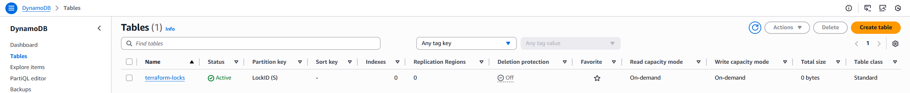
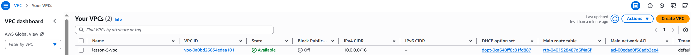
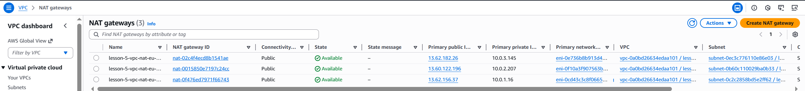
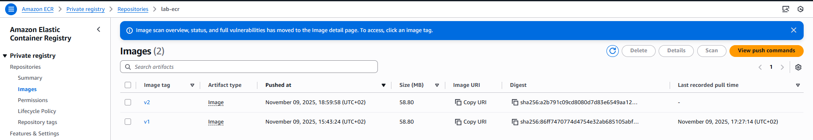

# 🧱 Lesson 7 — EKS + ECR + Helm + HPA (Django on AWS)

This lesson provisions an EKS cluster with Terraform, pushes a Django Docker image to ECR, and deploys the app to the cluster via a Helm chart with Horizontal Pod Autoscaler (HPA).

## 🎯 Objectives

- Provision EKS in an existing VPC using Terraform modules.
- Build and push the Django image to Amazon ECR.
- Deploy the app with a Helm chart (Deployment, Service, ConfigMap, Secret, HPA).
- Verify scaling with HPA (CPU-based).
- (Bonus) Add Ingress + TLS via cert-manager.

## 🗂️ Project Structure

```
dev-ops-ci-cd/
│
├── django/
│   ├── manage.py
│   ├── requirements.txt
│   ├── Dockerfile
│   ├── myproject/
│   │   ├── __init__.py
│   │   ├── asgi.py
│   │   ├── settings.py
│   │   ├── urls.py
│   │   └── wsgi.py
│   └── .env.example
│
├── lesson-7/
│   ├── charts/
│   │   └── django-app/
│   │       ├── Chart.yaml
│   │       ├── values.yaml
│   │       ├── values.secret.local.yaml # gitignored
│   │       ├── templates/
│   │       │   ├── _helpers.tpl
│   │       │   ├── configmap.yaml
│   │       │   ├── deployment.yaml
│   │       │   ├── hpa.yaml
│   │       │   ├── secret.yaml
│   │       │   └── service.yaml
│   │       └── README.md
│   │
│   ├── terraform/
│   │   ├── main.tf
│   │   ├── backend.tf
│   │   ├── outputs.tf
│   │   ├── variables.tf
│   │   ├── terraform.tfstate
│   │   ├── terraform.tfstate.backup
│   │   └── modules/
│   │       ├── s3-backend/
│   │       │   ├── s3.tf
│   │       │   ├── dynamodb.tf
│   │       │   ├── variables.tf
│   │       │   └── outputs.tf
│   │       ├── vpc/
│   │       │   ├── vpc.tf
│   │       │   ├── routes.tf
│   │       │   ├── variables.tf
│   │       │   └── outputs.tf
│   │       └── ecr/
│   │       |   ├── ecr.tf
│   │       |   ├── variables.tf
│   │       |   └── outputs.tf
│   │       └── eks/
│   │           ├── eks.tf
│   │           ├── variables.tf
│   │           └── outputs.tf
│   │
│   ├── screenshots/
│   ├── outputs.tf
│   ├── backend.tf
│   └── README.md
│
├── .gitignore
├── docker-compose.yaml
├── install_dev_tools.sh
└── README.md

```

## ⚙️ Terraform Modules Overview

### 🗑️ Module: `s3-backend`

Creates:

- **S3 bucket** for storing Terraform state files
- **DynamoDB table** for state locking
- Bucket versioning and encryption enabled

Outputs:

- S3 bucket name
- DynamoDB table name

### 🌐 Module: `vpc`

Creates:

- **VPC** with CIDR block
- 3 public and 3 private subnets across different Availability Zones
- **Internet Gateway (IGW)** for public subnets
- **NAT Gateways** for private subnets
- **Route tables** for traffic routing

Outputs:

- VPC ID
- Public and private subnet IDs

### 📦 Module: `ecr`

Creates:

- **ECR repository** with image scanning on push
- Configures encryption and tagging

Outputs:

- Repository URL

☸️ Module: `eks`

- Module: terraform-aws-modules/eks/aws
- Kubernetes version: 1.29 (target)

Features

- Public API endpoint (cluster endpoint accessible for kubectl)
- Managed Node Group deployed into private subnets

Managed Node Group (example settings)

- instance_types: ["t3.small"]
- desired_size: 1
- min_size: 1
- max_size: 2

Outputs

- eks_cluster_name
- eks_cluster_endpoint
- eks_node_group_name
- eks_oidc_provider_arn

Note

- With nodes in private subnets, NAT Gateways are required so nodes can pull images from ECR and access the internet securely.

...existing code...

## 📦 Helm Chart Overview (charts/django-app)

- deployment.yaml — uses the ECR image and envFrom ConfigMap/Secret
- service.yaml — LoadBalancer exposure (per task requirements)
- configmap.yaml — non-secret env (DB host/port/name, etc.)
- secret.yaml — sensitive env injected from values.secret.local.yaml (gitignored)
- hpa.yaml — CPU-based autoscaling (default 70%, min 1, max 3)
- values.yaml — image tag, service type/port, autoscaling params, optional ingress

Secrets file example (gitignored: values.secret.local.yaml):

```yaml
secret:
  enabled: true
  existingName: ""
  data:
    POSTGRES_USER: "django_user"
    POSTGRES_PASSWORD: "django_password"
```

## 🧩 Backend Configuration

Terraform backend stores the project’s state remotely in AWS S3 and uses DynamoDB for locking to prevent parallel modifications.

## 🔄 Terraform Workflow and Remote Backend

This project uses a **remote backend (S3 + DynamoDB)** to safely store and lock Terraform state files.
All Terraform commands operate on this centralized remote state to avoid configuration drift when working in teams.

The standard workflow is:

1. `terraform init` – connect to backend and download providers
2. `terraform plan -out=tfplan` – generate a plan of upcoming changes
3. `terraform apply tfplan` – apply the exact plan
4. `terraform destroy` – tear down the infrastructure

This guarantees repeatability and prevents concurrent state modifications.

##✅ Prerequisites

- Terraform 1.13.x (or >= 1.9)
- AWS CLI v2 configured with profile: terraform
- kubectl (compatible with K8s 1.29)
- Helm 3.x
- Docker (to build & push image)
- AWS Region: eu-north-1
- AWS CLI profile: terraform

Quick checks:

```bash
terraform version
aws sts get-caller-identity --profile terraform
kubectl version --client
helm version
docker version
```

## 🔐 AWS Access Configuration for Terraform

### 1. Create a dedicated IAM user `terraform`

For security reasons, Terraform should **not** run using the root account or an admin user.  
Instead, create a separate IAM user with only the permissions required for managing infrastructure.

#### Steps:

### 🧩 Step 1 — Base group: `terraform-lab`

This group contains basic permissions for Terraform backend and networking.

1. In the AWS Console go to **IAM → User groups → Create group**.  
   Name the group: `terraform-lab`

2. Attach the following AWS managed policies to the group:

   - `AmazonS3FullAccess` — for storing Terraform state in S3
   - `AmazonDynamoDBFullAccess` — for Terraform state locking (use this name; avoid a non-standard `_v2` suffix)
   - `AmazonEC2FullAccess` — for creating EC2 resources, VPC, subnets, NAT, routing
   - `AmazonEC2ContainerRegistryFullAccess` — for building and pushing Docker images to ECR

3. Create IAM user `terraform`:

   - Access type: **Programmatic access (CLI/API only)**
   - Add user `terraform` to group `terraform-lab`

4. Generate Access Keys for CLI use:
   - IAM → Users → `terraform` → **Security credentials** → **Create access key** → _Application running outside AWS_
   - Save `Access key ID` and `Secret access key` securely — used by the Terraform AWS provider.

---

### 🏗 Step 2 — Provisioning group: `terraform-provisioners`

This group contains additional permissions required to provision EKS and related resources.

1. In IAM → User groups → Create group, name it `terraform-provisioners`.

2. Attach these AWS managed policies:

   - `AmazonVPCFullAccess` — for networking components used by EKS
   - `CloudWatchFullAccess` (or the appropriate CloudWatch managed policy/version for your account) — for EKS log groups
   - `IAMFullAccess` — to create IAM roles and attach policies used by the EKS module
   - `AWSKeyManagementServicePowerUser` — optional, only if EKS cluster encryption with KMS is enabled

3. Attach a customer-managed policy `TerraformEKSProvision` (create this beforehand) which should include at least:

   - `eks:*` for managing clusters and node groups (or scoped least-privilege equivalents)
   - `iam:PassRole` limited to EKS-related roles
   - Access to S3 and DynamoDB backend resources used by Terraform
   - Minimal CloudWatch Logs permissions

4. Add the same IAM user `terraform` to this group:
   - IAM → Users → `terraform` → **Groups** → Add to `terraform-provisioners`

Notes

- Prefer least-privilege policies in production; the above managed policies are convenient for labs.
- Verify the user via `aws sts get-caller-identity --profile terraform` after configuring the AWS CLI.

### 🏗 Step 3

Generate **Access Keys** for this user:

- Navigate to `IAM → Users → terraform → Security credentials`
- Click **Create access key**
- Choose _Application running outside AWS_
- Save the `Access key ID` and `Secret access key` securely.

### 2. Configure AWS CLI Profile (Windows)

1. Install AWS CLI if not already installed:

```powershell
choco install awscli

```

2. Configure a new CLI profile named terraform:

```
aws configure --profile terraform
```

Enter the values:

```
AWS Access Key ID [None]: <your_access_key>
AWS Secret Access Key [None]: <your_secret_key>
Default region name [None]: eu-north-1
Default output format [None]: json
```

Verify the connection:

```
aws sts get-caller-identity --profile terraform
```

You should see your AWS Account ID and the ARN of the terraform user.

### 3. Using the profile in Terraform

In your Terraform configuration, specify the created profile:

```hcl
provider "aws" {
region = "eu-north-1"
profile = "terraform"
}
```

Terraform will automatically load credentials from this AWS CLI profile when executing commands.

This setup uses:

- **AWS region:** `eu-north-1`
- **AWS CLI profile:** `terraform`

Make sure that the same region and profile are configured in your AWS CLI before running any Terraform commands.

4. Validation and Initialization

Before deployment, run:

```bash
terraform init
terraform plan
terraform apply
```

Terraform will authenticate through your terraform IAM user using the terraform profile, ensuring secure and isolated access to AWS resources without requiring admin privileges.

## 🚀 How to Run

This project provisions AWS infrastructure with Terraform (remote state in S3 + DynamoDB), then deploys a Django app to EKS with Helm.
Infra and app deploys are separate: Terraform builds infra (incl. RDS PostgreSQL and a Kubernetes Secret django-db), Helm deploys the app using that secret and the image in ECR.

**Workflow**

1. Create backend storage (S3 + DynamoDB) for Terraform remote state.
2. Provision VPC, ECR, RDS (PostgreSQL), and EKS with Terraform.
3. Let Terraform create a Kubernetes Secret `django-db` containing DB credentials.
4. Build and push the Docker image to ECR.
5. Deploy the Django app to EKS via Helm, using the `django-db` secret and the ECR image URL from Terraform outputs.
6. (Optional) Install Metrics Server and validate HPA (Horizontal Pod Autoscaler).

### 1️⃣ Comment out the backend

Before the first run, open `\lesson-7\backend.tf` and temporarily disable the backend block:

```hcl
# terraform {
#   backend "s3" {
#     bucket         = "terraform-state-bucket-a3f7d92c"
#     key            = "lab/terraform.tfstate"
#     region         = "eu-north-1"
#     dynamodb_table = "terraform-locks"
#     encrypt        = true
#     profile        = "terraform"
#   }
# }
```

Terraform cannot initialize directly to an S3 backend if the bucket and DynamoDB table don’t exist yet.
This step ensures that state is handled locally until backend resources are provisioned.

### 2️⃣ Initialize and apply locally

```
cd lesson-7
terraform init
terraform validate

# create repo files and update cache (once)
helm repo add metrics-server https://kubernetes-sigs.github.io/metrics-server
helm repo update

terraform plan -out=tfplan
terraform apply tfplan
```

✅ ✅ This creates:

- S3 bucket for state + DynamoDB table for locking
- VPC (subnets, IGW/NAT, routes)
- ECR repository
- EKS cluster with a managed node group (+ admin bootstrap for creator)
- RDS PostgreSQL (private)
- Kubernetes Secret django-db (DB_HOST/PORT/NAME/USER/PASSWORD + DATABASE_URL) in the target namespace
- IAM roles/policies as needed

⚠️ Note: At this stage, Terraform still uses a **local state file (terraform.tfstate)**.  
The backend (S3 + DynamoDB) will be connected in the next step.

### 3️⃣ Re-enable the backend and migrate state to S3

Once all resources are created, uncomment the backend configuration in backend.tf:

```
terraform {
  backend "s3" {
    bucket         = "terraform-state-bucket-a3f7d92c"
    key            = "lab/terraform.tfstate"
    region         = "eu-north-1"
    dynamodb_table = "terraform-locks"
    encrypt        = true
    profile        = "terraform"
  }
}
```

Reconfigure Terraform to use the remote backend and migrate the local state to S3:

```
terraform init -reconfigure
# When prompted: "Do you want to copy existing state to the new backend?" -> yes
```

### 4️⃣ Validate backend connection

Run:

```
terraform state list
terraform plan
```

Expected output: **No changes**

In AWS Console:
S3 → you should see the file lab/terraform.tfstate in bucket terraform-state-bucket-a3f7d92c
DynamoDB → table terraform-locks will briefly show a LockID during Terraform operations

### 5️⃣ Configure access to the cluster

```bash
aws eks update-kubeconfig --name "$(terraform output -raw eks_cluster_name)" --region eu-north-1 --profile terraform
```

```bash
kubectl get nodes
```

Expected output: **one or more nodes in Ready state.**

## 6️⃣ Build and push the Django image to ECR

Retrieve the repository URL:

```bash
ECR_URL=$(terraform output -raw ecr_repository_url)
echo $ECR_URL
```

Authenticate Docker:

```bash
aws ecr get-login-password --region eu-north-1 --profile terraform | docker login --username AWS --password-stdin "$ECR_URL"
```

Build and push:

```bash
cd ../../django
TAG="v1"
docker build -t "$ECR_URL:$TAG" .
docker push "$ECR_URL:$TAG"
```

7️⃣ Deploy the Django app via Helm (uses Terraform secret)

```bash
cd lesson-7/charts/django-app
helm upgrade --install django ./ --namespace default --create-namespace --set image.repository="$(terraform -chdir=../.. output -raw ecr_repository_url)" --set image.tag="$TAG" -f values.yaml -f values.rds.yaml
```

Check deployment status:

```bash
kubectl get pods
kubectl get svc
kubectl get hpa
```

✅ The Service should show TYPE = LoadBalancer and an external IP — open this IP in your browser to view the Django app.

8️⃣ (Optional) Install Metrics Server for HPA

If HPA targets show unknown, install Metrics Server:

```bash
helm repo add metrics-server https://kubernetes-sigs.github.io/metrics-server
helm repo update
helm upgrade --install metrics-server metrics-server/metrics-server \
  --namespace kube-system \
  --set "args[0]=--kubelet-preferred-address-types=InternalIP" \
  --set "args[1]=--kubelet-insecure-tls" \
  --wait --timeout 5m
```

Validate:

```bash
kubectl -n kube-system get deploy metrics-server
kubectl top nodes
kubectl top pods -n default
kubectl get hpa -n default
```

If TARGETS stay unknown, wait 1–2 minutes for metrics to populate.

9️⃣ (Optional) Generate load to see scaling

```bash
# port-forward to local and stress with ab or wrk
kubectl -n default port-forward svc/django 8080:80 &
ab -n 2000 -c 50 http://localhost:8080/
kubectl -n default get hpa -w
```

✅ Done.
Infra is in Terraform (with remote state), DB creds are delivered via the django-db Kubernetes Secret created by Terraform, the app image comes from ECR, and the app is deployed by Helm independently of Terraform.

9️⃣ Cleanup

To delete the deployment and test again later:

```bash
helm uninstall django-app
```

🧹 Proper teardown when using an S3 backend (with DynamoDB locking)

Terraform cannot safely destroy its own remote backend if that backend is stored in an S3 bucket with versioning enabled. A simple `terraform destroy` may fail with:

- Error: `BucketNotEmpty` — the S3 bucket still contains objects or versions.
- Error releasing the state lock — DynamoDB lock table missing or unreadable.

Follow these steps to safely destroy all infrastructure, including backend resources.

🔧 **_Step-by-step teardown procedure_**

1. Comment out the S3 backend block in `/lesson-7/backend.tf` so Terraform will use a local backend for the teardown.

```hcl
# terraform {
#   backend "s3" {
#     bucket         = "terraform-state-bucket-XXXX"
#     key            = "lab/terraform.tfstate"
#     region         = "eu-north-1"
#     dynamodb_table = "terraform-locks"
#     encrypt        = true
#     profile        = "terraform"
#   }
# }
```

2. Re-initialize Terraform to use a local backend:

```
terraform init -reconfigure
# If prompted to migrate the state, confirm with:
# terraform init -migrate-state -lock=false
```

Terraform will now keep the state file locally (terraform.tfstate).

3. Refresh the local state without changing resources:

```
terraform plan -refresh-only
terraform apply -refresh-only -auto-approve
```

This ensures that the local state reflects the actual resources currently existing in AWS.

4. Manually empty the S3 bucket (including all versions and delete markers). Using the AWS Console is simplest for versioned buckets:

- Open S3 → your bucket → Show versions → select all objects & versions → Delete → Permanently delete.

5. Run final destroy:

```bash
terraform destroy -auto-approve
```

Now Terraform will cleanly remove:
All VPC, subnets, NAT gateways, etc.
The DynamoDB lock table (terraform-locks)
Any remaining AWS resources declared in your configuration.

8. Verify cleanup:

```bash
terraform state list
```

Command should show no remaining resources.

## 📸 Screenshots (Verification Results)

### 1. S3 Bucket and DynamoDB Lock




### 2. VPC and Subnets




### 3. NAT Gateways and Route Tables




### 4. ECR Repository



## 🛡️ Best Practices

- Use a dedicated IAM user for Terraform with minimal permissions.
- Store state remotely (S3 + DynamoDB) — never commit terraform.tfstate to Git.
- Enable versioning and encryption on your S3 bucket.
- Use separate workspaces or backends for dev/stage/prod environments.
- Rotate access keys periodically.

## 🧠 Learning Outcomes

- By completing this assignment, you will:
- Understand Terraform backend configuration and remote state management.
- Learn how to organize infrastructure into reusable modules.
- Practice creating AWS network resources (VPC, subnets, gateways).
- Deploy and manage container registry resources (ECR).
- Apply real-world infrastructure-as-code patterns used in professional DevOps workflows.
