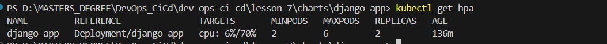
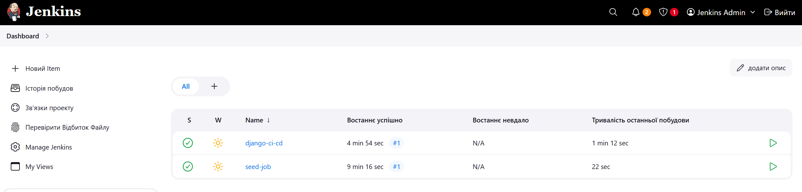
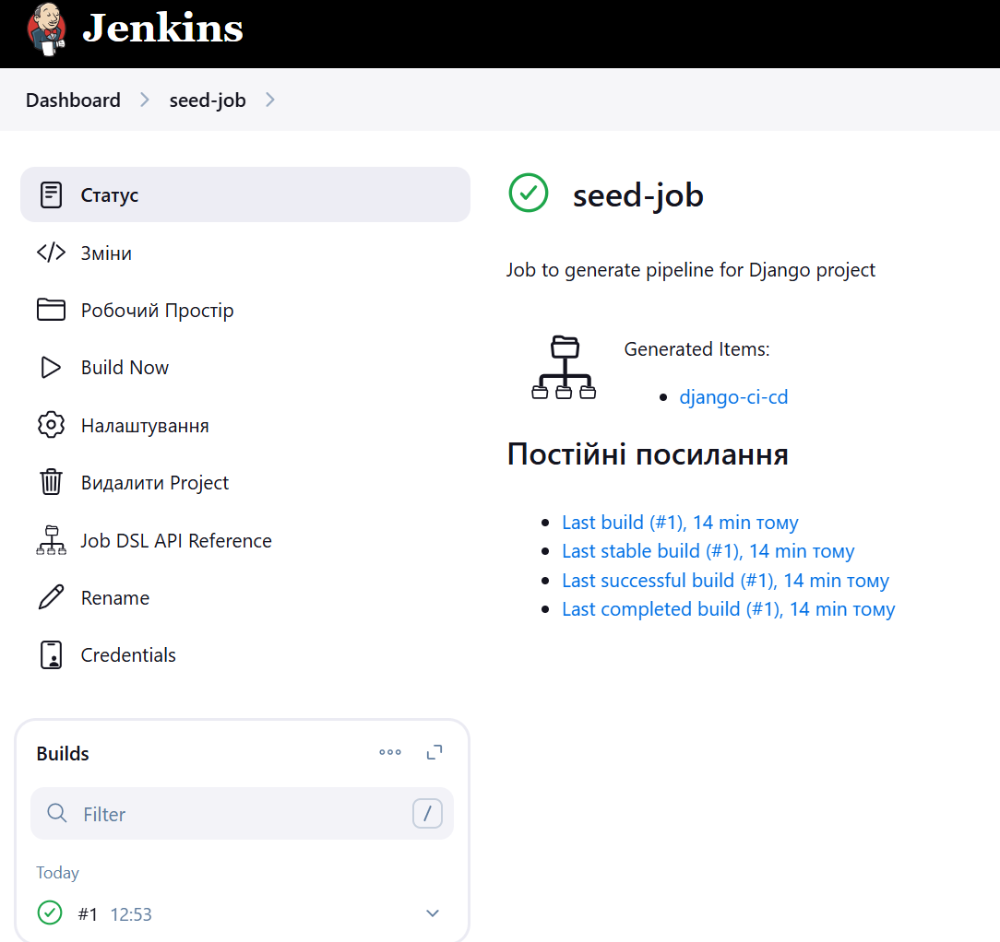
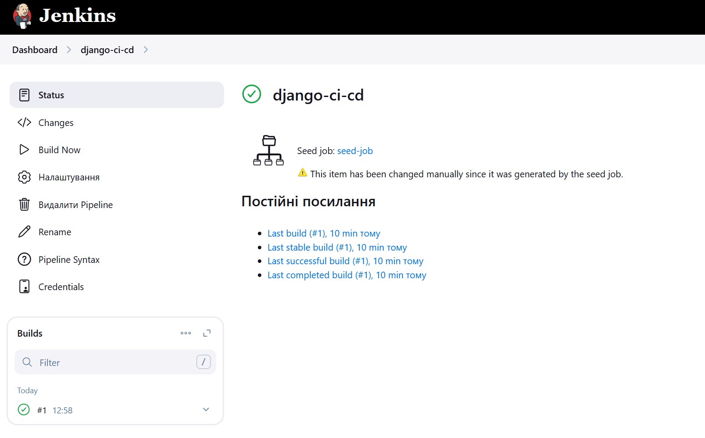
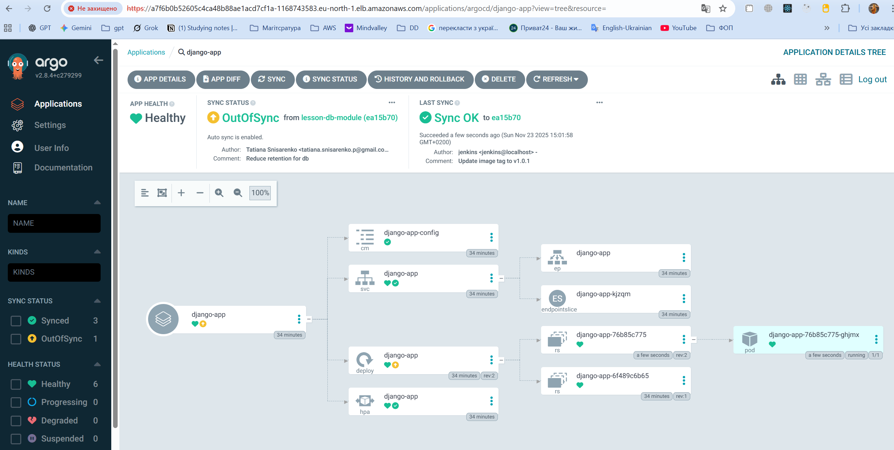

# 🧱 Lesson 7 — EKS + ECR + Helm + HPA (Django on AWS)

This lesson provisions an EKS cluster with Terraform, pushes a Django Docker image to ECR, and deploys the app to the cluster via a Helm chart with Horizontal Pod Autoscaler (HPA).

## 🎯 Objectives

- Provision EKS in an existing VPC using Terraform modules.
- Build and push the Django image to Amazon ECR.
- Provision a PostgreSQL database using a **universal RDS module** (standard RDS instance or Aurora cluster via `use_aurora`).
- Deploy the app with a Helm chart (Deployment, Service, ConfigMap, Secret, HPA).
- Verify scaling with HPA (CPU-based).
- (Bonus) Add Ingress + TLS via cert-manager.

## 🗂️ Project Structure

```
dev-ops-ci-cd/
│
├── django/
│   ├── manage.py
│   ├── requirements.txt
│   ├── Dockerfile
│   ├── myproject/
│   │   ├── __init__.py
│   │   ├── asgi.py
│   │   ├── settings.py
│   │   ├── urls.py
│   │   └── wsgi.py
│   └── .env.example
│
├── project/
│   ├── charts/
│   │   └── django-app/
│   │       ├── Chart.yaml
│   │       ├── values.yaml
│   │       ├── values.secret.local.yaml # gitignored
│   │       ├── templates/
│   │       │   ├── _helpers.tpl
│   │       │   ├── configmap.yaml
│   │       │   ├── deployment.yaml
│   │       │   ├── hpa.yaml
│   │       │   ├── secret.yaml
│   │       │   └── service.yaml
│   │       └── README.md
│   │
│   ├── terraform/
│   │   ├── main.tf
│   │   ├── backend.tf
│   │   ├── outputs.tf
│   │   ├── variables.tf
│   │   ├── terraform.tfstate
│   │   ├── terraform.tfstate.backup
│   │   └── modules/
│   │       ├── s3-backend/
│   │       │   ├── s3.tf
│   │       │   ├── dynamodb.tf
│   │       │   ├── variables.tf
│   │       │   └── outputs.tf
│   │       ├── vpc/
│   │       │   ├── vpc.tf
│   │       │   ├── routes.tf
│   │       │   ├── variables.tf
│   │       │   └── outputs.tf
│   │       └── ecr/
│   │       |   ├── ecr.tf
│   │       |   ├── variables.tf
│   │       |   └── outputs.tf
│   │       └── eks/
│   │       |   ├── eks.tf
│   │       |   ├── variables.tf
│   │       |   └── outputs.tf
|   |       ├── jenkins/
│   │       |   ├── jenkins.tf
│   │       |   ├── variables.tf
│   │       |   ├── providers.tf
│   │       |   ├── values.yaml
│   │       |   └── outputs.tf
│   │       |
│   |       └── argo_cd/             # ✅ Новий модуль для Helm-установки Argo CD
│   |           ├── argo_cd.tf       # Helm release для Jenkins
│   |           ├── variables.tf     # Змінні (версія чарта, namespace, repo URL тощо)
│   |           ├── providers.tf     # Kubernetes+Helm.  переносимо з модуля jenkins
│   |           ├── values.yaml      # Кастомна конфігурація Argo CD
│   |           ├── outputs.tf       # Виводи (hostname, initial admin password)
│	 |          └──charts/                  # Helm-чарт для створення app'ів
│ 	 |	            ├── Chart.yaml
│	 |	            ├── values.yaml          # Список applications, repositories
│	 |	            └── templates/
│	 |                  ├── application.yaml
│	 |                  └── repository.yaml
│   │
│   ├── screenshots/
│   ├── outputs.tf
│   ├── backend.tf
│   └── README.md
│
├── .gitignore
├── docker-compose.yaml
├── install_dev_tools.sh
└── README.md

```

### 🗄️ Module: `rds` (Universal RDS / Aurora PostgreSQL)

This module provisions the database layer for the Django application.

It supports two modes controlled by the `use_aurora` flag:

- `use_aurora = false` → **standard RDS instance** (`aws_db_instance`)
- `use_aurora = true` → **Aurora PostgreSQL cluster** (`aws_rds_cluster` + `aws_rds_cluster_instance` writer + replicas)

In both modes the module automatically creates:

- **DB Subnet Group** (`aws_db_subnet_group`) — uses private or public subnets depending on `publicly_accessible`
- **Security Group** (`aws_security_group`) — allows PostgreSQL port (5432) from the VPC CIDR
- **Parameter Group**:
  - `aws_db_parameter_group` for standard RDS
  - `aws_rds_cluster_parameter_group` for Aurora

#### Key inputs

- `name` — base name for DB resources
- `use_aurora` — switch between standard RDS and Aurora
- `engine`, `engine_version`, `parameter_group_family_rds` — RDS engine settings (e.g. `postgres`, `17.2`, `postgres17`)
- `engine_cluster`, `engine_version_cluster`, `parameter_group_family_aurora`, `aurora_replica_count` — Aurora engine settings (e.g. `aurora-postgresql`, `15.3`, `aurora-postgresql15`)
- `instance_class`, `allocated_storage`, `multi_az`
- `db_name`, `username`, `password`
- `vpc_id`, `subnet_private_ids`, `subnet_public_ids`, `publicly_accessible`, `vpc_cidr_block`
- `parameters` — `map(string)` with DB parameters (e.g. `max_connections`, `log_min_duration_statement`)
- `backup_retention_period`, `tags`

#### Outputs

- `endpoint` — RDS instance address **or** Aurora cluster endpoint
- `port` — database port
- `db_name`
- `master_username`
- `master_password`
- `security_group_id` — Security Group attached to the DB

These outputs are used in the root module to create a Kubernetes Secret `django-db`, which injects DB connection settings into the Django application.

## ⚙️ Terraform Modules Overview

### 🗑️ Module: `s3-backend`

Creates:

- **S3 bucket** for storing Terraform state files
- **DynamoDB table** for state locking
- Bucket versioning and encryption enabled

Outputs:

- S3 bucket name
- DynamoDB table name

### 🌐 Module: `vpc`

Creates:

- **VPC** with CIDR block
- 3 public and 3 private subnets across different Availability Zones
- **Internet Gateway (IGW)** for public subnets
- **NAT Gateways** for private subnets
- **Route tables** for traffic routing

Outputs:

- VPC ID
- Public and private subnet IDs

### 📦 Module: `ecr`

Creates:

- **ECR repository** with image scanning on push
- Configures encryption and tagging

Outputs:

- Repository URL

☸️ Module: `eks`

- Module: terraform-aws-modules/eks/aws
- Kubernetes version: 1.29 (target)

Features

- Public API endpoint (cluster endpoint accessible for kubectl)
- Managed Node Group deployed into private subnets

Managed Node Group (example settings)

- instance_types: ["t3.small"]
- desired_size: 1
- min_size: 1
- max_size: 2

Outputs

- eks_cluster_name
- eks_cluster_endpoint
- eks_node_group_name
- eks_oidc_provider_arn

Note

- With nodes in private subnets, NAT Gateways are required so nodes can pull images from ECR and access the internet securely.

...existing code...

## 📦 Helm Chart Overview (charts/django-app)

- deployment.yaml — uses the ECR image and envFrom ConfigMap/Secret
- service.yaml — LoadBalancer exposure (per task requirements)
- configmap.yaml — non-secret env (DB host/port/name, etc.)
- secret.yaml — sensitive env injected from values.secret.local.yaml (gitignored)
- hpa.yaml — CPU-based autoscaling (default 70%, min 1, max 3)
- values.yaml — image tag, service type/port, autoscaling params, optional ingress

Secrets file example (gitignored: values.secret.local.yaml):

```yaml
secret:
  enabled: true
  existingName: ""
  data:
    POSTGRES_USER: "django_user"
    POSTGRES_PASSWORD: "django_password"
```

## 🧩 Backend Configuration

Terraform backend stores the project’s state remotely in AWS S3 and uses DynamoDB for locking to prevent parallel modifications.

## 🔄 Terraform Workflow and Remote Backend

This project uses a **remote backend (S3 + DynamoDB)** to safely store and lock Terraform state files.
All Terraform commands operate on this centralized remote state to avoid configuration drift when working in teams.

The standard workflow is:

1. `terraform init` – connect to backend and download providers
2. `terraform plan -out=tfplan` – generate a plan of upcoming changes
3. `terraform apply tfplan` – apply the exact plan
4. `terraform destroy` – tear down the infrastructure

This guarantees repeatability and prevents concurrent state modifications.

##✅ Prerequisites

- Terraform 1.13.x (or >= 1.9)
- AWS CLI v2 configured with profile: terraform
- kubectl (compatible with K8s 1.29)
- Helm 3.x
- Docker (to build & push image)
- AWS Region: eu-north-1
- AWS CLI profile: terraform

Quick checks:

```bash
terraform version
aws sts get-caller-identity --profile terraform
kubectl version --client
helm version
docker version
```

## 🔐 AWS Access Configuration for Terraform

### 1. Create a dedicated IAM user `terraform`

For security reasons, Terraform should **not** run using the root account or an admin user.  
Instead, create a separate IAM user with only the permissions required for managing infrastructure.

#### Steps:

### 🧩 Step 1 — Base group: `terraform-lab`

This group contains basic permissions for Terraform backend and networking.

1. In the AWS Console go to **IAM → User groups → Create group**.  
   Name the group: `terraform-lab`

2. Attach the following AWS managed policies to the group:

   - `AmazonS3FullAccess` — for storing Terraform state in S3
   - `AmazonDynamoDBFullAccess` — for Terraform state locking (use this name; avoid a non-standard `_v2` suffix)
   - `AmazonEC2FullAccess` — for creating EC2 resources, VPC, subnets, NAT, routing
   - `AmazonEC2ContainerRegistryFullAccess` — for building and pushing Docker images to ECR

3. Create IAM user `terraform`:

   - Access type: **Programmatic access (CLI/API only)**
   - Add user `terraform` to group `terraform-lab`

4. Generate Access Keys for CLI use:
   - IAM → Users → `terraform` → **Security credentials** → **Create access key** → _Application running outside AWS_
   - Save `Access key ID` and `Secret access key` securely — used by the Terraform AWS provider.

---

### 🏗 Step 2 — Provisioning group: `terraform-provisioners`

This group contains additional permissions required to provision EKS and related resources.

1. In IAM → User groups → Create group, name it `terraform-provisioners`.

2. Attach these AWS managed policies:

   - `AmazonVPCFullAccess` — for networking components used by EKS
   - `CloudWatchFullAccess` (or the appropriate CloudWatch managed policy/version for your account) — for EKS log groups
   - `IAMFullAccess` — to create IAM roles and attach policies used by the EKS module
   - `AWSKeyManagementServicePowerUser` — optional, only if EKS cluster encryption with KMS is enabled

3. Attach a customer-managed policy `TerraformEKSProvision` (create this beforehand) which should include at least:

   - `eks:*` for managing clusters and node groups (or scoped least-privilege equivalents)
   - `iam:PassRole` limited to EKS-related roles
   - Access to S3 and DynamoDB backend resources used by Terraform
   - Minimal CloudWatch Logs permissions

4. Add the same IAM user `terraform` to this group:
   - IAM → Users → `terraform` → **Groups** → Add to `terraform-provisioners`

Notes

- Prefer least-privilege policies in production; the above managed policies are convenient for labs.
- Verify the user via `aws sts get-caller-identity --profile terraform` after configuring the AWS CLI.

### 🏗 Step 3

Generate **Access Keys** for this user:

- Navigate to `IAM → Users → terraform → Security credentials`
- Click **Create access key**
- Choose _Application running outside AWS_
- Save the `Access key ID` and `Secret access key` securely.

### 2. Configure AWS CLI Profile (Windows)

1. Install AWS CLI if not already installed:

```powershell
choco install awscli

```

2. Configure a new CLI profile named terraform:

```
aws configure --profile terraform
```

Enter the values:

```
AWS Access Key ID [None]: <your_access_key>
AWS Secret Access Key [None]: <your_secret_key>
Default region name [None]: eu-north-1
Default output format [None]: json
```

Verify the connection:

```
aws sts get-caller-identity --profile terraform
```

You should see your AWS Account ID and the ARN of the terraform user.

### 3. Using the profile in Terraform

In your Terraform configuration, specify the created profile:

```hcl
provider "aws" {
region = "eu-north-1"
profile = "terraform"
}
```

Terraform will automatically load credentials from this AWS CLI profile when executing commands.

This setup uses:

- **AWS region:** `eu-north-1`
- **AWS CLI profile:** `terraform`

Make sure that the same region and profile are configured in your AWS CLI before running any Terraform commands.

4. Validation and Initialization

Before deployment, run:

```bash
terraform init
terraform plan
terraform apply
```

Terraform will authenticate through your terraform IAM user using the terraform profile, ensuring secure and isolated access to AWS resources without requiring admin privileges.

## 🚀 How to Run

This project provisions AWS infrastructure with Terraform (remote state in S3 + DynamoDB), installs Jenkins and Argo CD using Helm (via Terraform), builds Docker images via Jenkins, and deploys applications to EKS through Argo CD using GitOps.

**The CI/CD flow now looks like this:**

- Terraform → provisions infrastructure (VPC, EKS, RDS, ECR, Jenkins, Argo CD).
- Jenkins → builds and pushes Docker images to ECR + updates Helm chart versions in Git.
- Argo CD → watches the Git repository and automatically syncs updated Helm charts into EKS.

### 0️⃣ Prerequisites

Before running the full stack:

- AWS CLI configured (profile = terraform)
- kubectl installed
- Terraform installed
- Docker installed (for initial sanity checks)
- GitHub repository accessible (public, or private with Jenkins credentials)

### 1️⃣ Comment out the backend

Before the first run, open `\lesson-7\backend.tf` and temporarily disable the backend block:

```hcl
# terraform {
#   backend "s3" {
#     bucket         = "terraform-state-bucket-a3f7d92c"
#     key            = "lab/terraform.tfstate"
#     region         = "eu-north-1"
#     dynamodb_table = "terraform-locks"
#     encrypt        = true
#     profile        = "terraform"
#   }
# }
```

Terraform cannot initialize directly to an S3 backend if the bucket and DynamoDB table don’t exist yet.
This step ensures that state is handled locally until backend resources are provisioned.

### 2️⃣ Initialize and apply locally

```
cd project
terraform init
terraform validate

# create repo files and update cache (once)
helm repo add metrics-server https://kubernetes-sigs.github.io/metrics-server
helm repo update

terraform plan -out=tfplan
terraform apply tfplan
```

✅ This creates:

- S3 bucket for state + DynamoDB table for locking
- VPC (subnets, IGW/NAT, routes)
- ECR repository
- EKS cluster with a managed node group (+ admin bootstrap for creator)
- RDS PostgreSQL (private)
- Kubernetes Secret django-db (DB_HOST/PORT/NAME/USER/PASSWORD + DATABASE_URL) in the target namespace
- IAM roles/policies as needed

⚠️ Note: At this stage, Terraform still uses a **local state file (terraform.tfstate)**.  
The backend (S3 + DynamoDB) will be connected in the next step.

### 3️⃣ Re-enable the backend and migrate state to S3

Once all resources are created, uncomment the backend configuration in backend.tf:

```
terraform {
  backend "s3" {
    bucket         = "terraform-state-bucket-a3f7d92c"
    key            = "lab/terraform.tfstate"
    region         = "eu-north-1"
    dynamodb_table = "terraform-locks"
    encrypt        = true
    profile        = "terraform"
  }
}
```

Reconfigure Terraform to use the remote backend and migrate the local state to S3:

```
terraform init -reconfigure
# When prompted: "Do you want to copy existing state to the new backend?" -> yes
```

### 4️⃣ Validate backend connection

Run:

```
terraform state list
terraform plan
```

Expected output: **No changes**

In AWS Console:
S3 → you should see the file lab/terraform.tfstate in bucket terraform-state-bucket-a3f7d92c
DynamoDB → table terraform-locks will briefly show a LockID during Terraform operations

### 5️⃣ Update the Django Chart and Jenkinsfile With Your ECR URL (one-time step)

`After Terraform finishes:

```bash
terraform output -raw ecr_repository_url
```

Put this URL (example: 123456789012.dkr.ecr.eu-north-1.amazonaws.com/django-app) into:

project/charts/django-app/values.yaml:

```bash
image:
  repository: "<your-ecr-url>"
  tag: "v1"
  pullPolicy: IfNotPresent
```

\Jenkinsfile

```bash
ECR_REPOSITORY = "<your-ecr-url>"

```

Commit changes:

```
git add .
git commit -m "Set ECR image repository for Argo CD"
git push
```

Argo CD now knows where the image will come from.

## 6️⃣ Configure Jenkins Credentials (GitHub PAT)

Get url

```bash
kubectl get svc jenkins -n jenkins
```

Copy host name and open in browser

http://<цей-hostname>/

Get password:

```bash
$pass64 = kubectl get secret jenkins -n jenkins -o jsonpath='{.data.jenkins-admin-password}'
$bytes  = [System.Convert]::FromBase64String($pass64)
$pass   = [System.Text.Encoding]::UTF8.GetString($bytes)
$pass
```

Use login = admin and pass to login into Jenkins UI

In Jenkins UI configure credentials:

Manage Jenkins → Credentials → Global → Add Credentials

Type: Username + Password

- Username = your GitHub username
- Password = GitHub Personal Access Token (PAT)
- ID = github-token

This credential will be used in the Jenkins pipeline to push Helm chart updates back to Git.

## 7️⃣ Jenkins: Trigger Initial Seed Job

In Jenkins → Dashboard → Jobs: seed-job start manually with Build Now

If seed job fails - this may be caused by security reasons - you need to allow script running mannually:

In Jenkins Dashboard -> Manage Jenkins -> ScriptApproval -> Approve script

Re-run seed-job

Terraform has already installed Jenkins and applied its JCasC configuration.

Port-forward or use the LoadBalancer service:

```bash
kubectl -n jenkins get svc
```

If LoadBalancer:

Open URL → log in (admin credentials from Jenkins output).

Run the Seed Job → it will generate the main pipeline:

```bash
django-ci-cd
```

## 8️⃣ Full CI Pipeline (Jenkinsfile Execution)

When you run the django-ci-cd pipeline:

Jenkins will automatically:

- Build your Django Docker image using Kaniko
- Tag it with $BUILD_NUMBER or another version
- Push it to ECR
- Clone your GitOps repo
- Update:

```
charts/django-app/values.yaml → image.tag: "new-tag"
```

- Commit and push the change
- Notify Argo CD via GitOps

## 9️⃣ Argo CD Automatically Syncs the Updated Chart

Get Argo CD URL:

```bash
kubectl -n argocd get svc argo-cd-argocd-server  -o wide
```

If LoadBalancer is used:

Open in browser → log in:
username: admin
Password (Terraform output):

```bash
kubectl -n argocd get secret argocd-initial-admin-secret -o go-template="{{.data.password | base64decode}}"

```

Argo CD will detect Git changes and automatically:

- Pull the updated Helm chart
- Update Deployment in EKS
- Restart pods
- Sync HPA, ConfigMap, Secrets, etc.

Check rollout:

```bash
kubectl get pods -n default
kubectl get svc -n default
kubectl get deploy -n default
kubectl get hpa -n default
```

🔟 Validate the Application

```bash
kubectl get svc -n default
```

Open the hostname in the browser → Django app should respond.

### 🔁 Switching from standard RDS to Aurora (optional)

By default the configuration uses a **standard RDS PostgreSQL instance**:

```hcl
module "rds_postgres" {
  source = "./modules/rds"

  name       = "${var.cluster_name}-db"
  use_aurora = false

  engine                     = "postgres"
  engine_version             = "17.2"
  parameter_group_family_rds = "postgres17"

  # shared settings
  instance_class    = "db.t3.micro"
  allocated_storage = 20

  db_name  = var.db_name
  username = var.db_username
  password = random_password.rds_master.result

  vpc_id             = module.vpc.vpc_id
  subnet_private_ids = module.vpc.private_subnet_ids
  subnet_public_ids  = module.vpc.public_subnet_ids

  publicly_accessible = false
  multi_az            = false

  vpc_cidr_block          = var.vpc_cidr_block
  backup_retention_period = "0"

  parameters = {
    max_connections            = "200"
    log_min_duration_statement = "500"
  }
}
```

To switch this module to an Aurora PostgreSQL cluster, only a few values need to be changed:

```hcl
module "rds_postgres" {
  source = "./modules/rds"

  name       = "${var.cluster_name}-aurora"
  use_aurora = true

  # Aurora engine
  engine_cluster             = "aurora-postgresql"
  engine_version_cluster     = "15.3"
  parameter_group_family_aurora = "aurora-postgresql15"
  aurora_replica_count       = 1

  # RDS engine settings are ignored when use_aurora = true
  engine                     = "postgres"
  engine_version             = "17.2"
  parameter_group_family_rds = "postgres17"

  # shared settings
  instance_class    = "db.t3.medium"
  allocated_storage = 20 # ignored by Aurora

  db_name  = var.db_name
  username = var.db_username
  password = random_password.rds_master.result

  vpc_id             = module.vpc.vpc_id
  subnet_private_ids = module.vpc.private_subnet_ids
  subnet_public_ids  = module.vpc.public_subnet_ids

  publicly_accessible = false
  vpc_cidr_block      = var.vpc_cidr_block

  backup_retention_period = "0"

  parameters = {
    max_connections            = "200"
    log_min_duration_statement = "500"
  }
}
```

## Cleanup

To delete the deployment and test again later:

```bash
kubectl delete app django-app -n argocd
helm uninstall jenkins -n jenkins
```

🧹 Proper teardown when using an S3 backend (with DynamoDB locking)

Terraform cannot safely destroy its own remote backend if that backend is stored in an S3 bucket with versioning enabled. A simple `terraform destroy` may fail with:

- Error: `BucketNotEmpty` — the S3 bucket still contains objects or versions.
- Error releasing the state lock — DynamoDB lock table missing or unreadable.

Follow these steps to safely destroy all infrastructure, including backend resources.

🔧 **_Step-by-step teardown procedure_**

1. Comment out the S3 backend block in `/lesson-7/backend.tf` so Terraform will use a local backend for the teardown.

```hcl
# terraform {
#   backend "s3" {
#     bucket         = "terraform-state-bucket-XXXX"
#     key            = "lab/terraform.tfstate"
#     region         = "eu-north-1"
#     dynamodb_table = "terraform-locks"
#     encrypt        = true
#     profile        = "terraform"
#   }
# }
```

2. Re-initialize Terraform to use a local backend:

```
terraform init -reconfigure
# If prompted to migrate the state, confirm with:
# terraform init -migrate-state -lock=false
```

Terraform will now keep the state file locally (terraform.tfstate).

3. Refresh the local state without changing resources:

```
terraform plan -refresh-only
terraform apply -refresh-only -auto-approve
```

This ensures that the local state reflects the actual resources currently existing in AWS.

4. Manually empty the S3 bucket (including all versions and delete markers). Using the AWS Console is simplest for versioned buckets:

- Open S3 → your bucket → Show versions → select all objects & versions → Delete → Permanently delete.

5. Run final destroy:

```bash
terraform destroy -auto-approve
```

Now Terraform will cleanly remove:
All VPC, subnets, NAT gateways, etc.
The DynamoDB lock table (terraform-locks)
Any remaining AWS resources declared in your configuration.

8. Verify cleanup:

```bash
terraform state list
```

Command should show no remaining resources.

## 📸 Screenshots (Verification Results)

### 1. S3 Bucket and DynamoDB Lock


### 2. VPC


### 3. ECR Repository


### 4. HPA



### 5. Jenkins







### 6. Argo CD



### 5. Django app


## 🛡️ Best Practices

- Use a dedicated IAM user for Terraform with minimal permissions.
- Store state remotely (S3 + DynamoDB) — never commit terraform.tfstate to Git.
- Enable versioning and encryption on your S3 bucket.
- Use separate workspaces or backends for dev/stage/prod environments.
- Rotate access keys periodically.

## 🧠 Learning Outcomes

By completing this assignment, you will:

- Understand Terraform backend configuration and remote state management.
- Learn how to organize infrastructure into reusable modules.
- Practice creating AWS network resources (VPC, subnets, gateways).
- Deploy and manage container registry resources (ECR).
- Provision a production-like PostgreSQL database using a **universal RDS module** with support for **Aurora**.
- Integrate DB credentials into Kubernetes via Secrets and Helm charts.
- Apply real-world infrastructure-as-code and GitOps patterns used in professional DevOps workflows.
